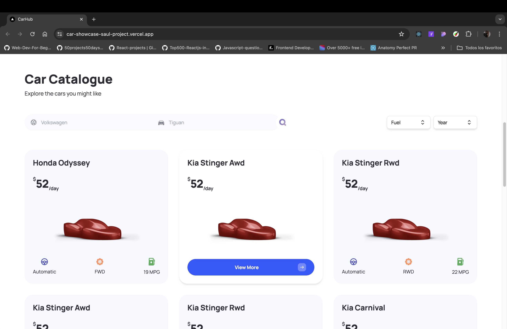
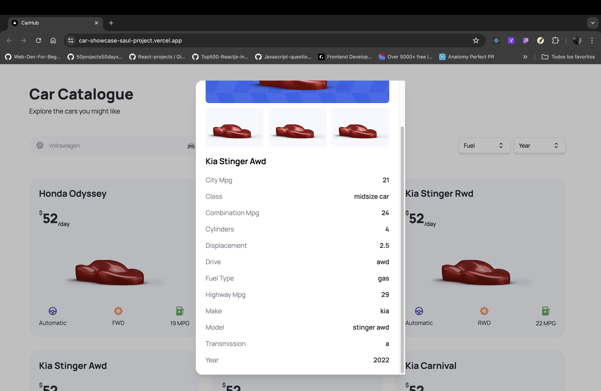
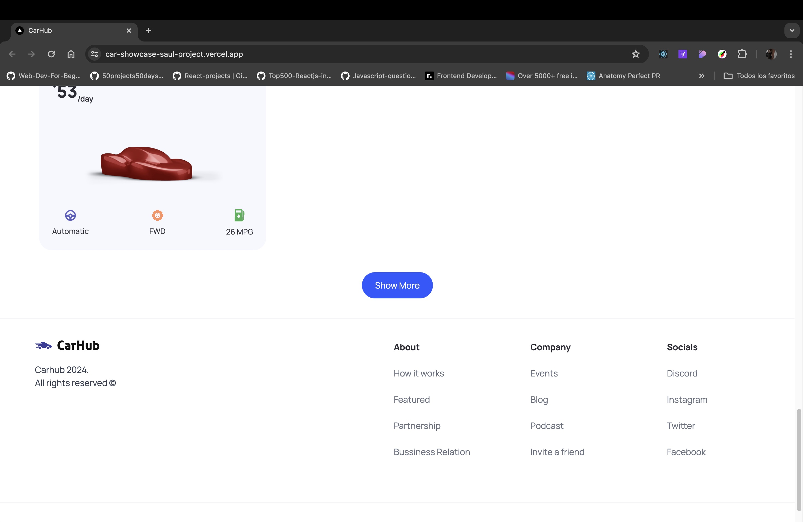
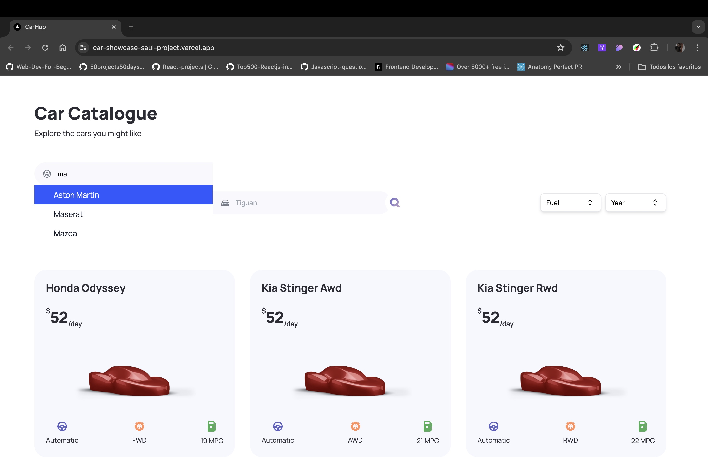
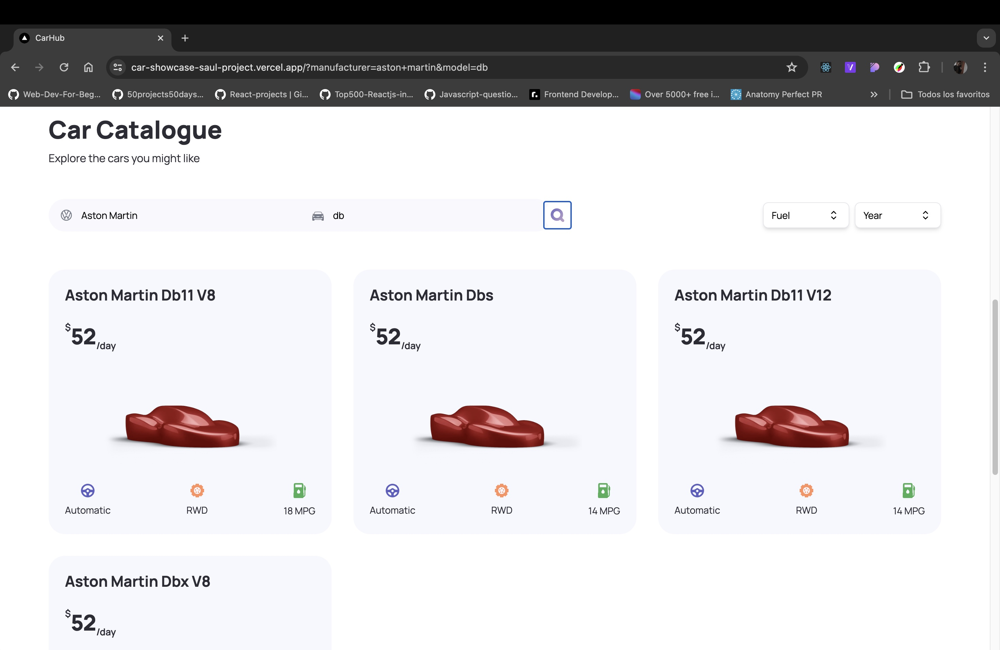
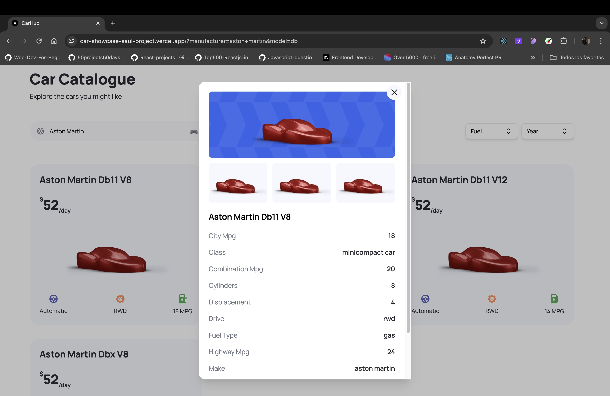
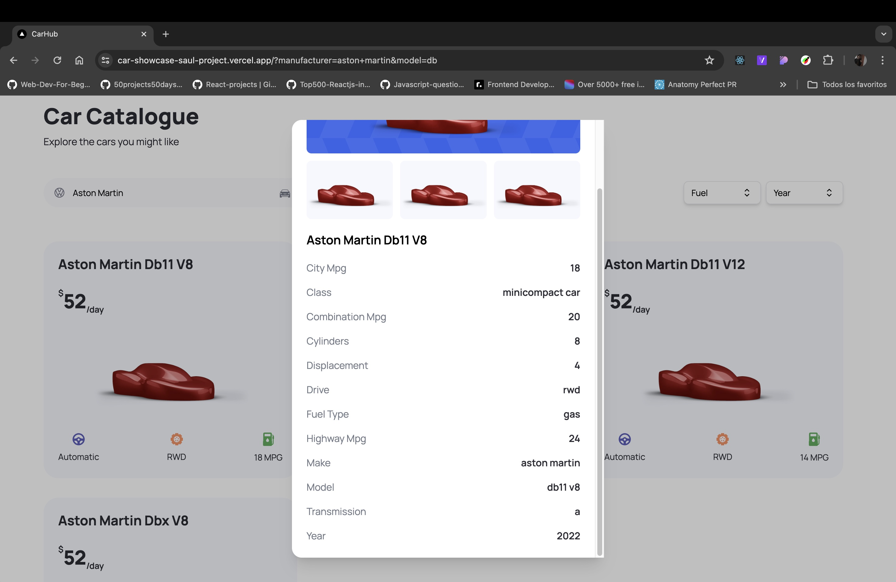
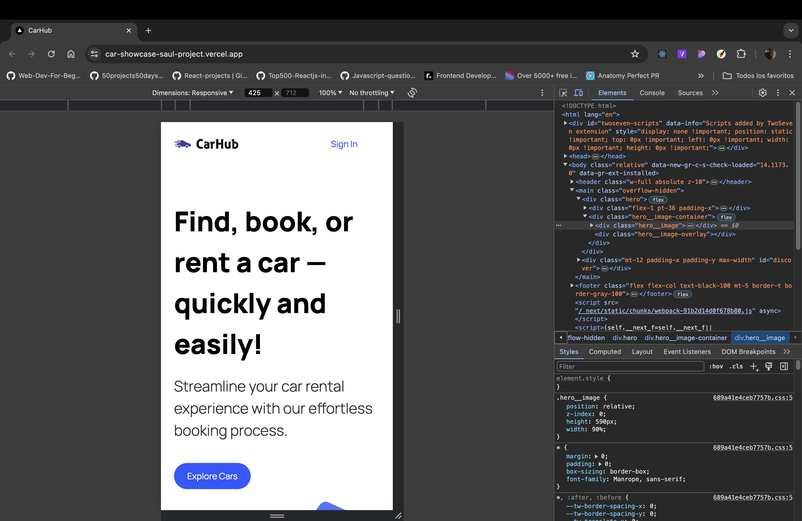
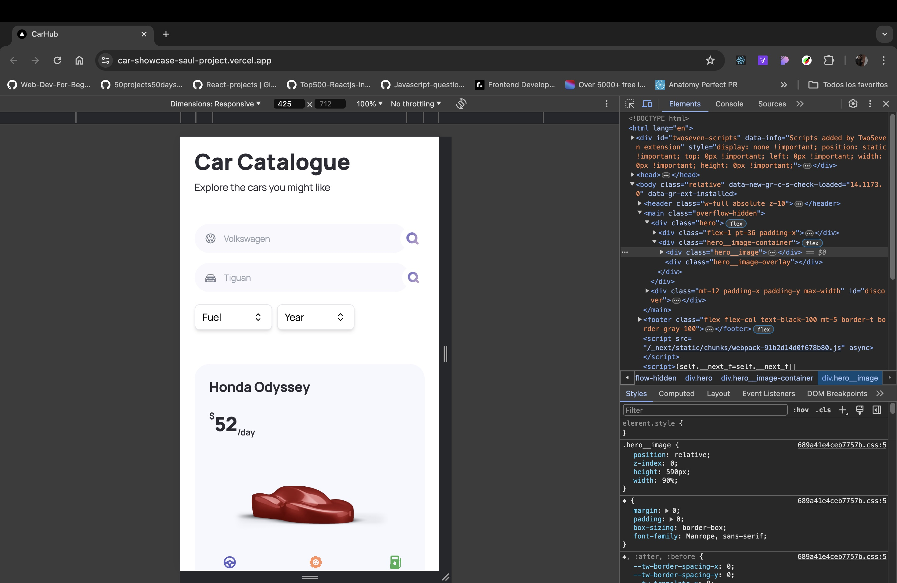

# 🚀 CAR SHOWCASE: Dynamic E-commerce Product Visualization Platform

## **STRATEGIC ARCHITECTURE & BUSINESS VALUE**

### 🎯 Identified Market Problem & Value Proposition

> **Core Problem:** The need for high-impact visual presentation and complex filtering capabilities to efficiently connect consumers with specific inventory (e.g., car listings) in an e-commerce context.
>
> **T-Shape Solution:** Developed a sophisticated product visualization platform focusing on **advanced filtering, dynamic search, and optimized asset loading**. This project validates the ability to architect interfaces that manage large product catalogs with high usability.

### 📈 Key Metrics, Anti-AI Strategy, and Business Alignment

*   **Performance Priority:** Fast loading of visual assets (car images/models) and instantaneous response to complex search filter changes.
*   **Strategy Anti-AI:** The value is in designing the **end-to-end data flow and search architecture** to handle multi-faceted user queries and translate API responses into clean product cards—a task requiring strategic data aggregation and display expertise.
*   **Monetization/Value Stream:** Focuses on maximizing lead generation and conversion by providing a superior product browsing and filtering experience.

---

## **DEEP SOFTWARE ARCHITECTURE**

### 🛠️ Core Technology Stack

| Technology | Role and Strategic Justification |
| :--- | :--- |
| **Framework** | Next.js 14 (TypeScript) |
| **Backend/DB** | <Implied: External Car Data API / Database for inventory> |
| **Styling** | Tailwind CSS |
| **Auth** | None |
| **AI/Services** | Next.js Image Optimization, Advanced Filtering Logic |

### ⚙️ Key Architectural Decisions

1.  **Next.js (Image Optimization):** Crucial for handling large car images efficiently, using Next.js's native optimization to maintain high **Core Web Vitals** scores.
2.  **Dynamic Filtering Logic:** Designed a scalable architecture to handle dynamic search inputs (make, model, year, price) and update the UI without full page reloads.
3.  **TypeScript:** Used to enforce type safety across the inventory data structure, vital for search accuracy and preventing data inconsistencies.

---

## **T-SHAPE SUPERPOWERS & EXECUTION CHALLENGES**

### 🧠 Strategic Challenges Overcome

*   **Challenge 1:** Managing complex, simultaneous filter states and ensuring accurate data presentation.
*   **Solution 1:** Implemented robust URL search parameter management and efficient client-side state synchronization.
*   **Challenge 2:** Optimizing asset delivery (images) to achieve high performance while maintaining visual quality.
*   **Solution 2:** Strict use of optimized image components and lazy loading for off-screen assets.

### 💻 Local Setup (Quick Start)

```bash
# 1. Clone the repository
git clone https://github.com/saulkurosaki/CAR-SHOWCASE-PROJECT

# 2. Change directory
cd CAR-SHOWCASE-PROJECT

# 3. Install dependencies
npm install

# 4. Configure environment variables
# Create a .env.local file and add the necessary keys for external API access (e.g., car data API).

# 5. Start Development Server
npm run dev
```
---
















